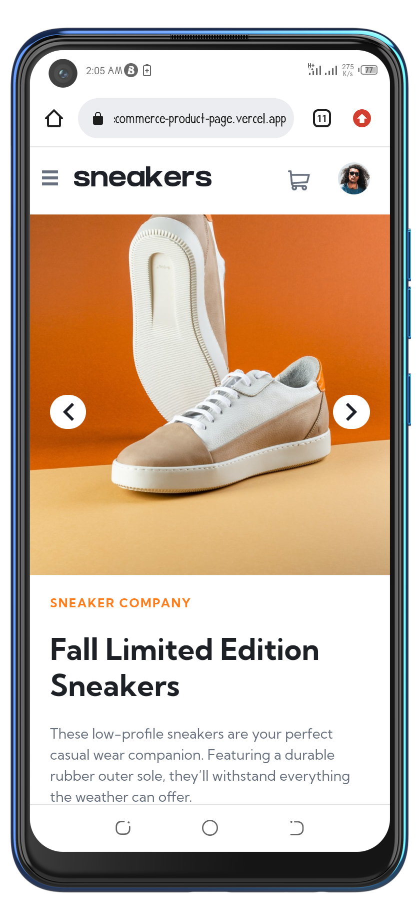
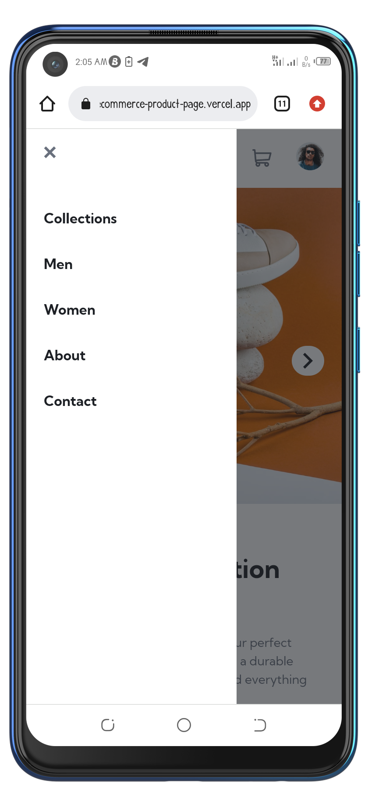
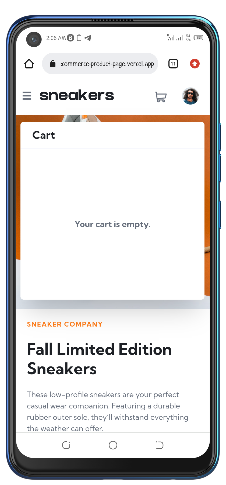
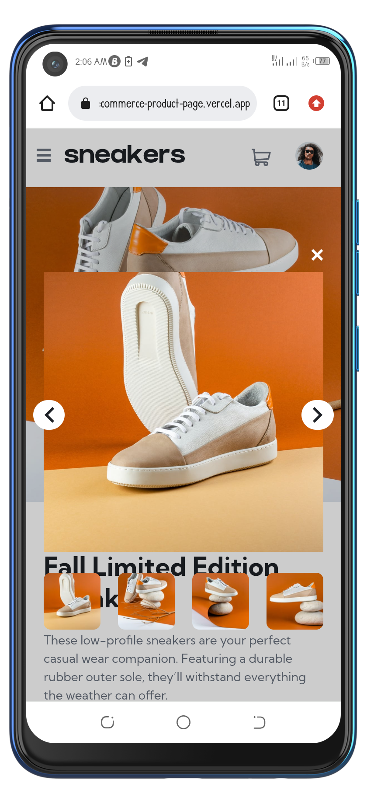
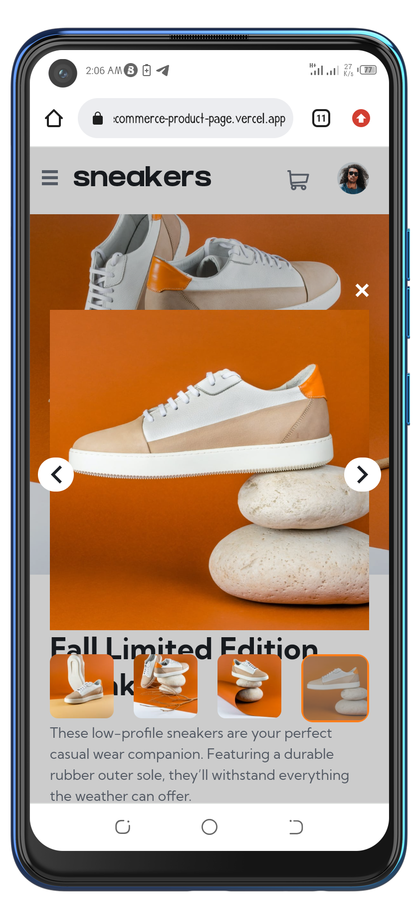
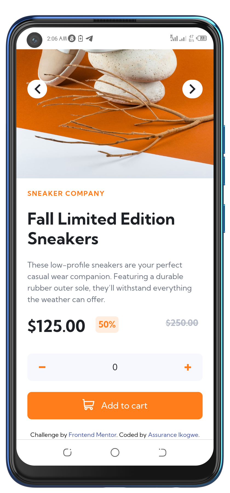
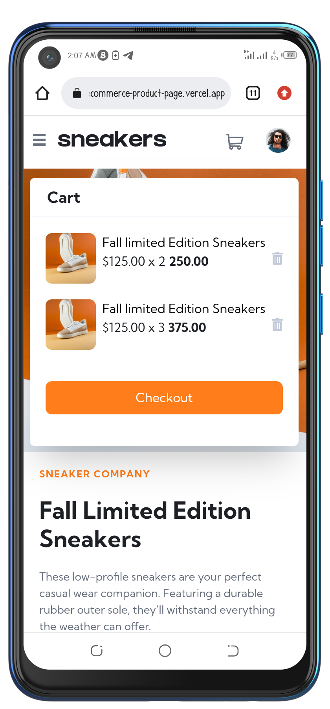

# Frontend Mentor - E-commerce product page solution

This is a solution to the [E-commerce product page challenge on Frontend Mentor](https://www.frontendmentor.io/challenges/ecommerce-product-page-UPsZ9MJp6). Frontend Mentor challenges help you improve your coding skills by building realistic projects.

## Table of contents

- [Overview](#overview)
  - [The challenge](#the-challenge)
  - [Screenshot](#screenshot)
  - [Links](#links)
- [My process](#my-process)
  - [Built with](#built-with)
  - [What I learned](#what-i-learned)
  - [Continued development](#continued-development)
  - [Useful resources](#useful-resources)
- [Author](#author)
- [Acknowledgments](#acknowledgments)

## Overview

### The challenge

Users should be able to:

- View the optimal layout for the site depending on their device's screen size
- See hover states for all interactive elements on the page
- Open a lightbox gallery by clicking on the large product image
- Switch the large product image by clicking on the small thumbnail images
- Add items to the cart
- View the cart and remove items from it

### Screenshot

.png)
.png)
.png)
.png)
.png)
.png)
.png)












### Links

- Solution URL: [Add solution URL here](https://your-solution-url.com)
- Live Site URL: [Add live site URL here](https://aik-ecommerce-product-page.vercel.app/)

## My process

### Built with

- Semantic HTML5 markup
- Tailwind CSS
- Flexbox
- Mobile-first workflow
- [React](https://reactjs.org/) - JS library


### What I learned

My light box code

```React

import React from 'react'
import Imagepreview from './Body/Imagepreview'

export default function LightBox(props) {
  return (
    <section className='fixed top-0 right-0 bottom-0 left-0 bg-opacity-0 flex flex-col justify-center content-center items-center w-full h-screen px-5 sm:h-auto sm:w-[70%] sm:px-16 lg:w-[50%] lg:px-32 mx-auto lg:mt-6 space-y-3 z-50' onClick={(e) => e.stopPropagation()}>
        <figure className='self-end'>
            <svg width="14" height="15" xmlns="http://www.w3.org/2000/svg" className='cursor-pointer fill-[#fff] hover:fill-[#ff7d1a]' onClick={props.close}><path d="m11.596.782 2.122 2.122L9.12 7.499l4.597 4.597-2.122 2.122L7 9.62l-4.595 4.597-2.122-2.122L4.878 7.5.282 2.904 2.404.782l4.595 4.596L11.596.782Z" fillRule="evenodd"/></svg>
        </figure>
        <Imagepreview for={true}/>
    </section>
  )
}

```


### Continued development

I would like to use react redux to manage state instead of excessive passing of state from one component to another.


### Useful resources

- [Example resource 1](https://developer.mozilla.org/en-US/docs/Web/JavaScript/Reference/Global_Objects/Array/splice) - This is an amazing article which helped me finally understand javascript array splice method. I'd recommend it to anyone still learning this concept.
- [Example resource 2](https://stackoverflow.com/questions/69228627/how-to-properly-check-the-current-index-of-an-array-in-a-react-map) - This helped me to add to get the index of an element from a .map array function. I really liked this pattern and will use it going forward.
- [Example resource 3](https://www.w3schools.com/howto/howto_js_lightbox.asp) - This helped me in creating my lightbox feature. I really liked this pattern and will use it going forward.
- [Example resource 4](https://stackoverflow.com/questions/54114171/how-to-play-an-mp3-once-onclick-in-react) - This helped me to add audio to the page when a new item gets added to the cart. I really liked this pattern and will use it going forward.


## Author

- Github - [@Aik-202](https://aik-202.github.io/aik-ecommerce-product-page/)
- Frontend Mentor - [@Aik-202](https://www.frontendmentor.io/profile/Aik-202)
- Twitter - [@chiomaikogwe](https://www.twitter.com/chiomaikogwe)